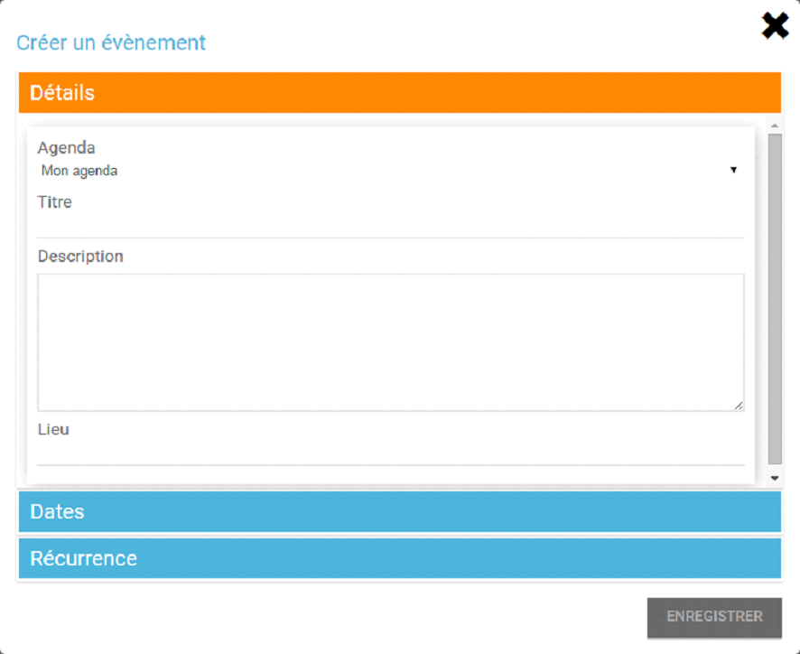
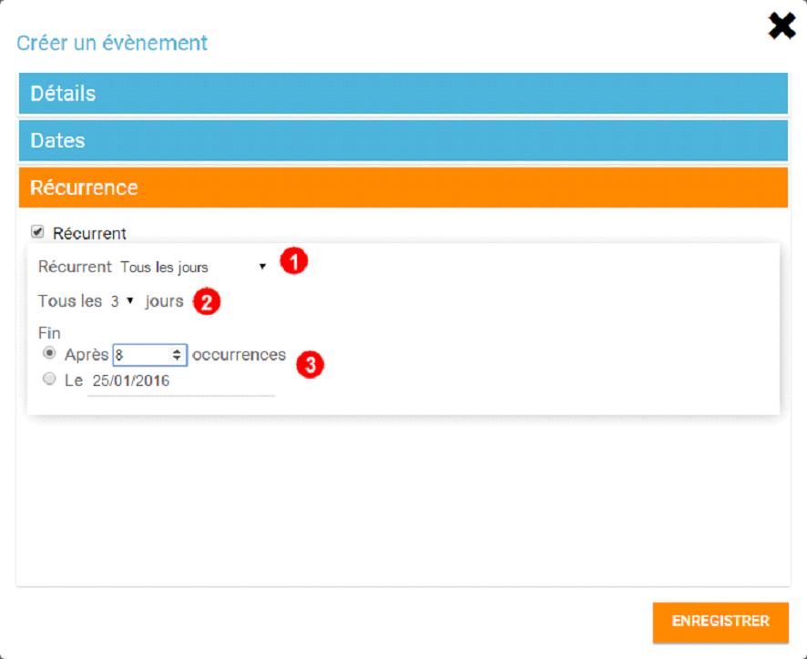
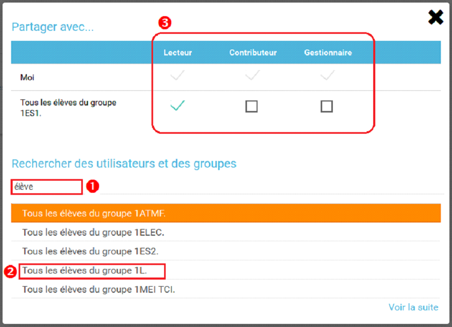
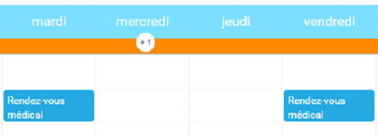
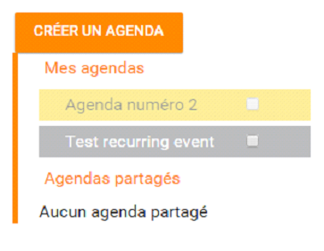
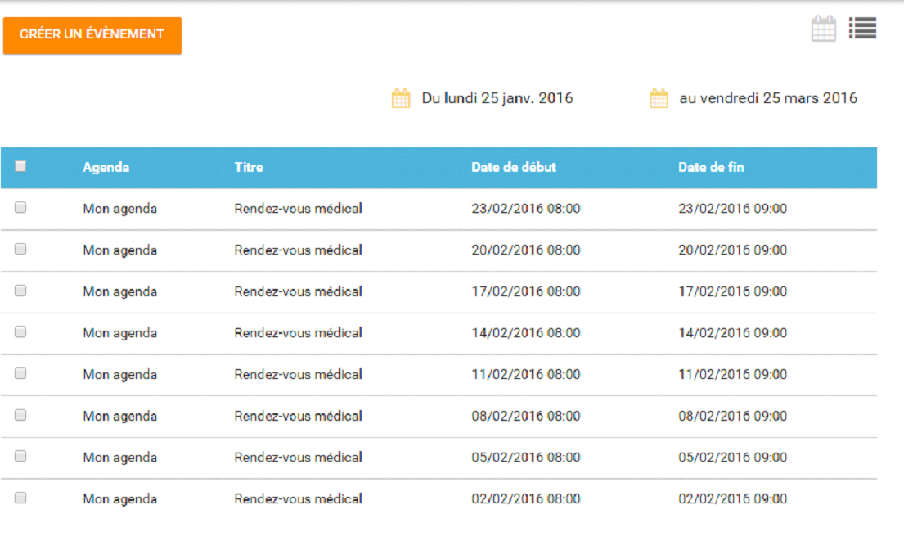

L’appli **Agenda** permet la création et la visualisation d’événements sous forme d’un calendrier ou d’une liste.

Présentation
============

Le service Agenda permet de créer et partager des évènements.

[  
image:../../wp-content/uploads/2016/01/Agenda-Page-1-1024x615.png\[Agenda - Page 1,width=599,height=360](../../wp-content/uploads/2016/01/Agenda-Page-1.png)  
\]

Il comprend les éléments suivants :

1.  Un menu de gauche pour créer un agenda et où sont listés les agendas qui appartiennent à l’utilisateur et ceux qui lui sont partagés.

2.  Un bandeau qui permet de faire défiler les semaines.

3.  Les 2 icônes en haut à droite permettent de permuter l’affichage du mode calendrier  

au mode liste d’événements .

1.  Le calendrier qui permet d’afficher les événements des agendas sélectionnés.

Créer un agenda
===============

Pour créer un agenda, cliquez sur le bouton « Créer un agenda » dans le menu de gauche (1).  
Il faut ensuite saisir un titre pour l’agenda et éventuellement choisir une couleur avant de valider l’enregistrement.

Une fois créé, l’agenda apparaît dans la liste des agendas de l’utilisateur.

Depuis cette liste il est possible d’accéder aux opérations sur l’agenda en le sélectionnant à l’aide de la case à cocher (2).  
Un menu apparaît alors en bas de l’écran proposant les actions supplémentaires suivantes.  

Description des actions :

-   Exporter, télécharge l’agenda sélectionné au format .ics ;  

-   Importer, permet l’import des événements d’un calendrier au format .ics dans l’agenda sélectionné ;  

-   Modifier, permet de modifier le titre ou la couleur associée à l’agenda sélectionné ;  

-   Supprimer, permet la suppression de l’agenda sélectionné après confirmation ;  

-   Partager, permet le partage de l’agenda sélectionné avec d’autres utilisateurs.

Créer un événement
==================

Pour créer un événement, plusieurs options s’offrent à l’utilisateur, il est possible de cliquer dans le calendrier au créneau horaire souhaité ou d’utiliser le bouton .

La fenêtre de création d’événement apparait en popup. Elle se décompose en trois onglets.

  

Le premier onglet appelé "Détails" comporte les informations générales de l’événement à créer :

-   l’agenda auquel il appartient (à sélectionner parmi la liste des calendriers que l’utilisateur peut modifier),  

-   le titre de l’événement,  

-   la description,  

-   le lieu.

Le second onglet appelé "Dates" permet la sélection de la plage horaire de l’événement.

Il est possible de changer les dates et heures de début et de fin. La case à cocher « Toute la journée » permet de définir un événement sans heure de début ou de fin.

Enfin le dernier onglet appelé "Récurrence" permet de définir la récurrence de l’événement si nécessaire.

Pour cela, il faut cocher la case « Récurrent » pour pouvoir accéder à la sélection du paramétrage de la récurrence.  
Ensuite, il est possible de modifier :

1.  le type de récurrence (Tous les jours ou Toutes les semaines)

2.  la fréquence de la récurrence (Tous les X jours ou Y semaines)

**Si le type de récurrence est « Toutes les semaines », la liste des jours de la semaine apparaît afin de choisir le ou les jours sur lesquelles se produira la récurrence (ici tous les mercredis une semaine sur 2).**

     3.  la fin de la série d’événements récurrents. Cette fin peut être paramétrée après un nombre d’occurrences ou à une date donnée.

Partager un agenda
==================

L’accès au partage de la ressource calendrier se fait grace au menu du bas lors de la sélection d’un calendrier dans la liste des calendriers de l’utilisateur.

  
Dans la fenêtre, vous pouvez donner aux utilisateurs de l’ENT différents droits d’accès à votre agenda. Pour cela, suivez les étapes suivantes :

1.  Saisissez les premières lettres du nom de l’utilisateur ou du groupe d’utilisateurs que vous recherchez.

2.  Sélectionnez le résultat.

3.  Cochez les cases correspondantes aux droits que vous souhaitez leur attribuer.

Les droits de partage que vous pouvez attribuer aux autres utilisateurs sont les suivants :

-   **Lecteur**: l’utilisateur peut lire le contenu

-   **Contribuer**: l’utilisateur peut contribuer à votre agenda

-   **Gestionnaire**: l’utilisateur peut modifier ou supprimer ou partager l’agenda

Visualiser les événements d’un agenda
=====================================

Les événements créés sont affichés sur la vue calendrier avec comme couleur de fond celle de l’agenda auxquels ils appartiennent. Si un événement est situé en dehors de la plage horaire affichée par le calendrier une petite bulle contenant le nombre d’événements antérieurs est affichée (+1 ici).

Il est possible de choisir les agendas affichés sur le calendrier en cliquant dessus dans la partie de gauche. Les agenda non sélectionnés sont grisés (ici « Agenda numéro 2 » est désactivé).

La seconde façon de visualiser les événements est la vue liste accessible par l’icône  en haut à droite de la vue principale.

Elle synthétise les informations des événements des différents agendas affichés.

 

Note de version
===============

**Nouveautés de la version 0.3**

-   Ajout d’un assistant à la saisie des heures

-   Correction d’un décalage des horaires lors de la saisies d'événements récurrents

-   Correction dans l’affichage des champs obligatoires et validation des formulaires

-   Correction de la prise en compte de la modification des événements

