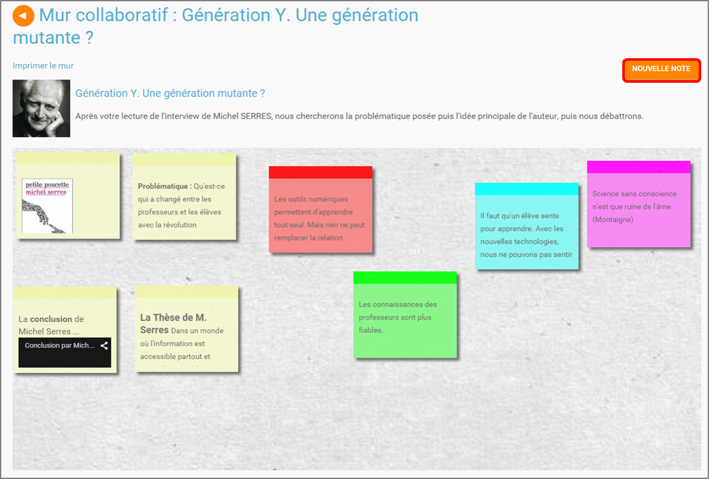
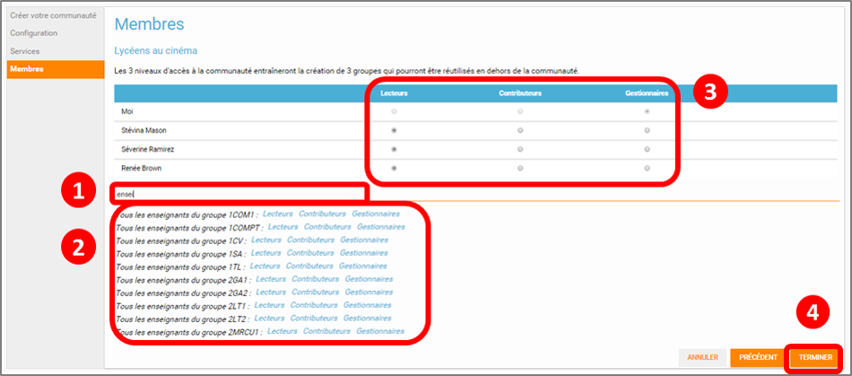

L’appli **Communautés** permet de **rassembler** un **groupe d’utilisateurs** autour d’un **intérêt commun** pour **communiquer**, **partager** ou **collaborer** en utilisant différentes applis **(Blog, Forum, Wiki, Documents…).**

Présentation
============

Plutôt que de proposer un usage centré sur un outil (le blog ou le wiki par exemple), l’appli communautés permet de rassembler un groupe d’utilisateurs autour d’un **projet collaboratif.** Pour chaque communauté créée (Espace CDI, parcours artistique, communauté de l’association sportive, …), il est possible de définir précisément les droits de chaque utilisateur et les applis mises à disposition (blog, wiki, documents, forum, pages…).

Créer et partager une communauté
================================

Pour accéder à l’appli Communautés, cliquez sur l’icône correspondante dans la page « Mes applis ».

Cliquez sur « Créer une communauté ».

Un assistant de création apparait pour vous guider dans les étapes à suivre.

Cliquez sur « Suivant ».

L’onglet Configuration de l’assistant s’affiche.

1.  Saisissez un titre de communauté

2.  Chargez une image d’illustration si vous le souhaitez

3.  Renseignez une description

4.  Cliquez sur « Suivant »

L’onglet Services de l’assistant s’affiche.

1.  Choisissez les services que vous souhaitez utiliser dans votre Communauté.

2.  Cliquez sur « Suivant »

L’onglet Membres de l’assistant s’affiche.

Dans cet onglet, vous décidez avec qui vous souhaitez partager votre communauté.

1.  Saisissez les premières lettres du nom d’un utilisateur ou d’un groupe.

2.  Cliquez sur les utilisateurs ou groupes d’utilisateurs avec lesquels vous souhaitez partager la communauté.

3.  Définissez les droits accordés pour chaque membre de la communauté.

Lorsque vous ajoutez un groupe d’utilisateurs, chaque membre du groupe est affiché pour que vous puissiez définir les droits de partage au cas par cas.

Les différents droits que vous pouvez attribuer aux autres utilisateurs sont les suivants :

-   Lecture : l’utilisateur peut visualiser les contenus créés dans la communauté

-   Contribution : l’utilisateur peut créer du contenu dans les services de la communauté

-   Gestion : l’utilisateur peut partager, modifier et supprimer la communauté

 4. Cliquez sur « Suivant ».

La communauté est maintenant créée et partagée. Chaque appli de la communauté est accessible de manière différenciée. Par exemple, le wiki  de la communauté est accessible depuis l’appli communauté et depuis l’appli wiki.

Des listes de diffusion des utilisateurs de la communauté sont automatiquement créées: lecteurs de la communauté, contributeurs de la communauté et gestionnaires de la communauté. Ces listes de diffusion peuvent être utilisées dans tous les services de l’ENT.

 

Pour savoir comment créer du contenu dans les différents services de votre communauté,  reportez-vous aux cas d’usages de chacun de ces services.

Note de version
===============

A chaque nouvelle version de l’application, les nouveautés seront présentées dans cette section.
