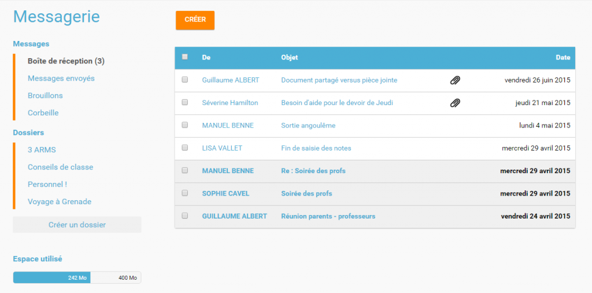
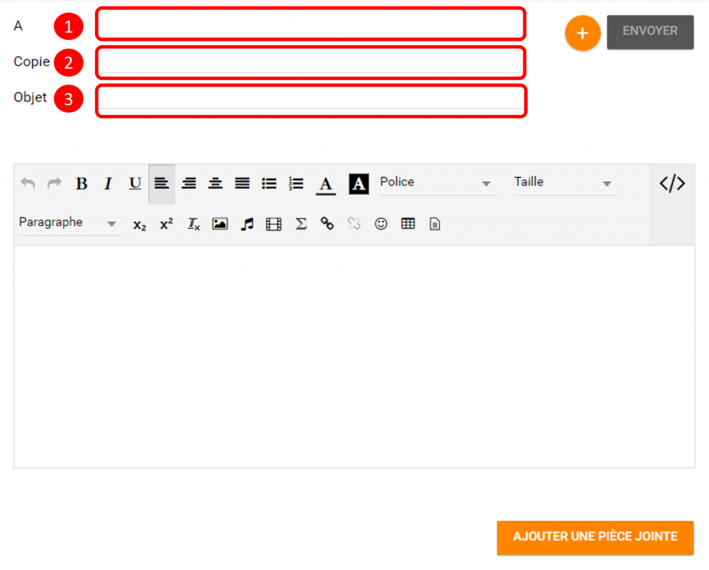
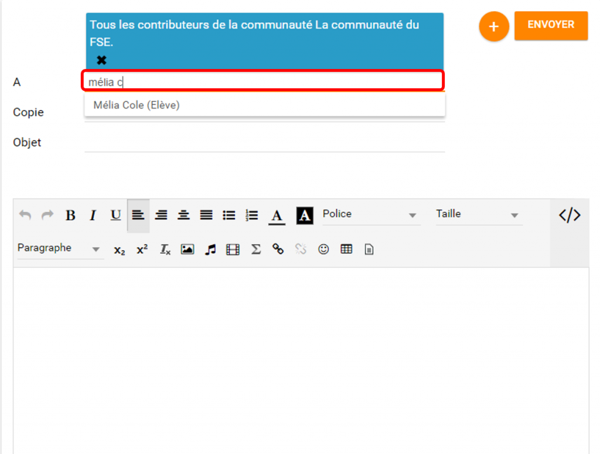
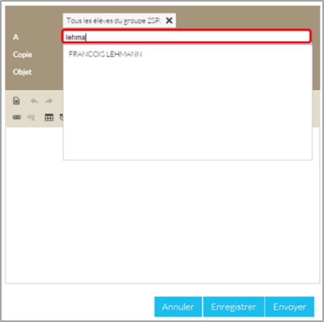
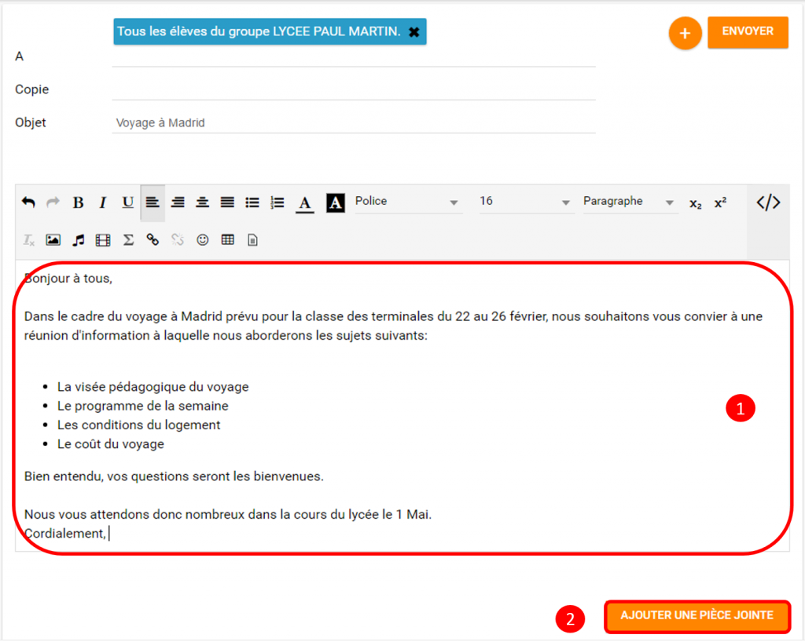
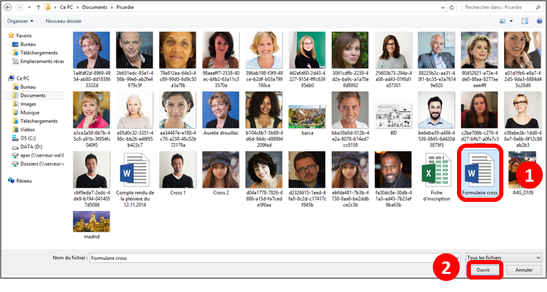
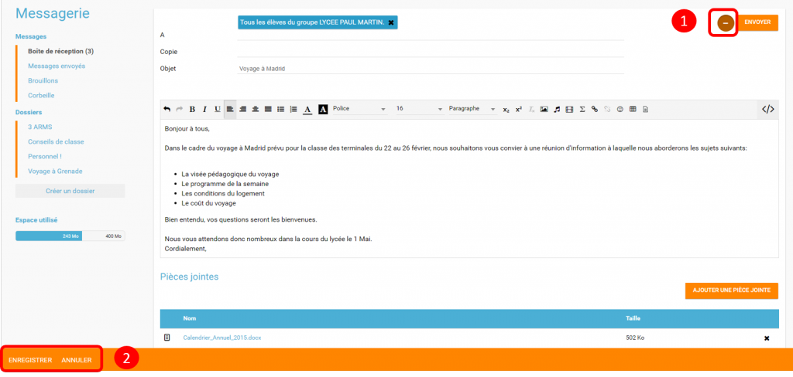
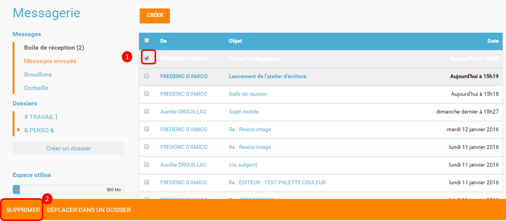
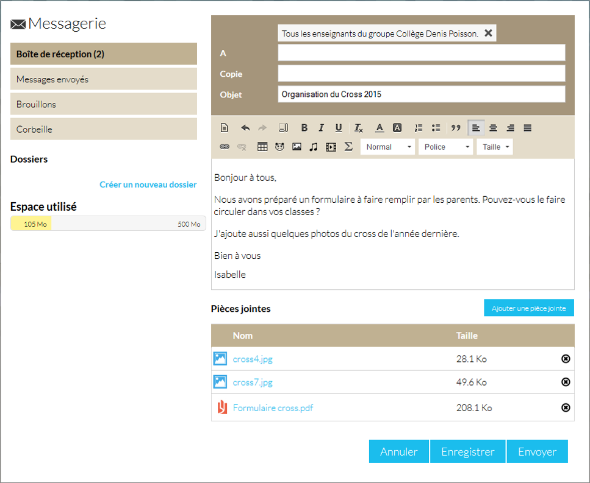
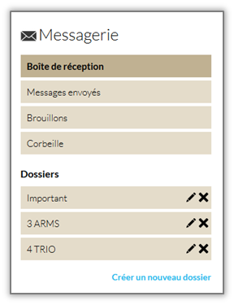

La **Messagerie** permet d’échanger des messages électroniques avec d’autres utilisateurs selon des règles de communication préalablement définies.  

Présentation
============

L’appli Messagerie permet d’envoyer simplement un message à **un utilisateur** ou à un **groupe d’utilisateurs** (les élèves d’une classe, le personnel de l'établissement, etc.) ayant un accès à l’ENT.

La réception d’un nouveau message est visible dès la page d’accueil. Elle est indiquée par une **notification** dans le bandeau de navigation  et dans le fil de nouveautés.

Envoyer un message
==================

Dans le service Messagerie, cliquez sur le bouton « Créer » présent en haut de la page.

Vous accédez à la fenêtre de création d’un message.

Indiquez le(s) destinataire(s) de votre message dans le champ « A » en saisissant les premières lettres de son nom (1). Vous pouvez adresser un message à un utilisateur en particulier (par exemple un élève), ou à un groupe d’utilisateurs (par exemple les parents d’élèves de Terminale). La liste des résultats s’affiche automatiquement.

1.  Ajoutez des personnes ou des groupes dans le champ « Copie » si vous souhaitez leur adresser une copie du message.

2.  Indiquez le sujet de votre message dans le champ « Objet ».

Dans la fenêtre de saisie de contenu, rédigez votre message (1). Cliquez sur "Ajouter une pièce jointe" (2) pour joindre un document à votre message.

  
Choisissez le document depuis votre poste de travail.

Une fois que votre message est prêt, vous pouvez l’envoyer.

  
Vous pouvez également enregistrer le message en tant que brouillon ou l’annuler en cliquant sur " + " (1) puis sur le bouton correspondant (2).

Visualiser mes messages reçus
=============================

Lorsque vous recevez un nouveau message, la notification est indiquée dans le bandeau de navigation supérieur.

Une fois dans l’appli messagerie, les nouveaux messages sont visibles dans la notification indiquée dans le dossier « boîte de réception ». Le nombre de messages non lus est indiqué entre parenthèses à droite du lien « Boîte de réception » (1). Sur l’écran central, les nouveaux messages s’affichent en gras (2).

Cliquez sur le titre d’un message pour en lire le contenu.

 

Supprimer un message
====================

Vous pouvez supprimer vos messages en cliquant sur la case à cocher correspondant au(x) message(s) (1).

Puis cliquez sur le bouton « Supprimer » qui apparait en bas à gauche de la page (2).

Le message se trouve maintenant dans votre corbeille. Vous pouvez le supprimer définitivement ou le restaurer en le sélectionnant dans le dossier « Corbeille ».

Note de version
===============

Nouveautés de la version 1.13.1

**Pièces jointes**

La messagerie permet maintenant d’envoyer des pièces jointes.

Cela présente par exemple l’avantage que le destinataire conserve les documents associés au message même si l’expéditeur l’a supprimé de sa boite d’envoi.

**Dossiers dans la boite de réception**

Il est désormais possible de classer les messages de la boite de réception dans des dossiers. Chaque utilisateur peut créer et gérer ses propres dossiers.

Nouveauté de la version 1.12.0

**Bouton Supprimer**

Le bouton qui permet de supprimer les messages sélectionnés ne s’affiche plus en haut de l’écran mais dans un menu qui apparaît en bas de l’écran de manière à être cohérent avec le fonctionnement des boutons d’action des autres services de l’ENT.
