L’appli Exercices et évaluations est un outil de création, de distribution et de corrections d’exercices pour les enseignants. Les élèves peuvent réaliser les exercices demandés dans le temps imparti et consulter les corrections renseignées par les enseignants *a posteriori* de la réalisation de l’exercice.

Présentation
============

L’appli Exercices et évaluations permet de créer des sujets, de les distribuer et d’en faire automatiquement ou manuellement la correction. Grâce à la Bibliothèque de l’appli, il est notamment possible de rechercher des sujets publiés par d’autres enseignants et de les ajouter à ses sujets personnels pour une réutilisation ou une adaptation.

Elève / Apprenant - Réaliser un exercice
========================================

Depuis la page d’accueil, cliquez sur « Mes applis » en haut à droite de l’écran puis cliquez sur « Exercices et évaluations ». Vous retrouvez les sujets à réaliser dans la semaine à gauche de l’écran. Cliquez sur le sujet de votre choix.

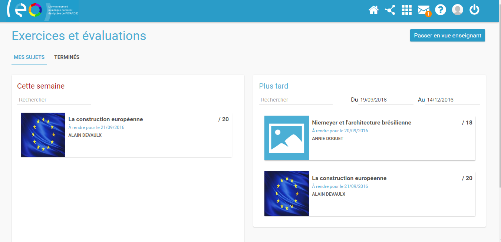

 

Une présentation du sujet s’affiche précisant la date de rendu (1), la durée de réalisation (2) et une description de l’exercice.

Pour réaliser l’exercice, cliquez sur le bouton orange « suivant » en bas à droite de la fenêtre.

 

Les questions du sujet s’affichent l’une après l’autre. Il vous suffit d’indiquer la réponse dans le champ réservé (1) et de cliquer sur « suivant » (2) pour poursuivre l’exercice.

En cas de difficulté à trouver la réponse, une aide peut parfois vous être proposée. Il suffit de cliquer sur le bouton « Aide à la réponse » en haut à droite de l’écran (3).

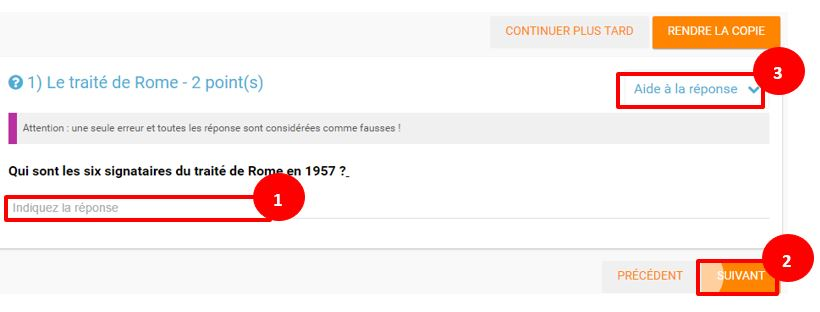

 

Si vous souhaitez vous interrompre et continuer plus tard l’exercice, vous pouvez cliquer sur le bouton "continuer plus tard".

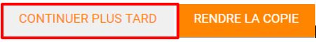

Dans le cas où la date de rendue de la copie est **dépassée**, le sujet affiché dans la page d’accueil comporte un bouton « rendre la copie » pour que l’élève puisse tout de même rendre sa copie, en revanche il ne pourra plus y accéder.

Une fois l’exercice terminé, cliquez sur rendre la copie. Un message de confirmation s’affiche :

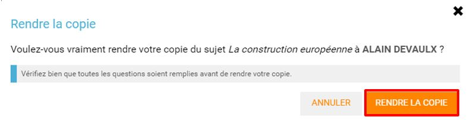

Elève / Apprenant – Voir la correction d’un exercice
====================================================

Lorsqu’un exercice est corrigé, vous êtes informés via une publication sur le fil de nouveauté.

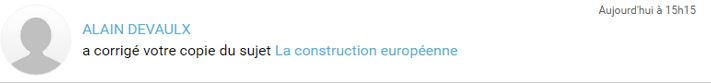

Vous pouvez vous rendre sur l’application « Exercices et évaluations », cliquez sur l’onglet « terminés » en haut et à gauche de la page (1).

Les sujets corrigés s’affichent.

Cliquez ensuite sur le sujet dont vous souhaitez voir la correction (2).

Un résumé s’affiche avec le score final et éventuellement des commentaires formulés par le professeur.

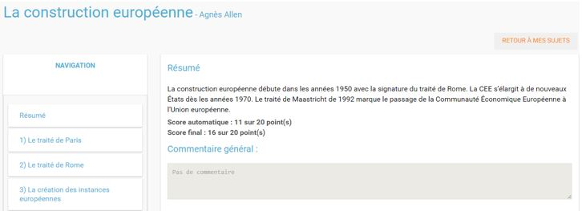

Vous pouvez ensuite accéder au-dessous à la correction par question.

Les bonnes réponses s’affichent en vert et les mauvaises en rouge.

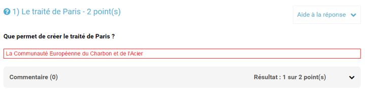

Enseignant - Créer un nouveau sujet
===================================

Depuis la page d’accueil, cliquez sur « Mes applis » en haut à droite de l’écran puis cliquez sur « Exercices et évaluations ».

Pour créer un nouveau sujet, cliquez sur le bouton « nouveau sujet » dans la page d’accueil de l’appli.

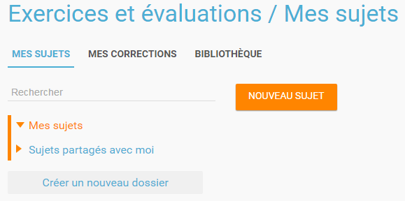

Saisissez un titre (1) et ajoutez  si vous le souhaitez une image d’illustration du sujet (sinon c’est l’icône par défaut qui est affichée) (2). Vous pouvez ajouter une description (3).

Cliquez enfin sur « Enregistrer » (4)

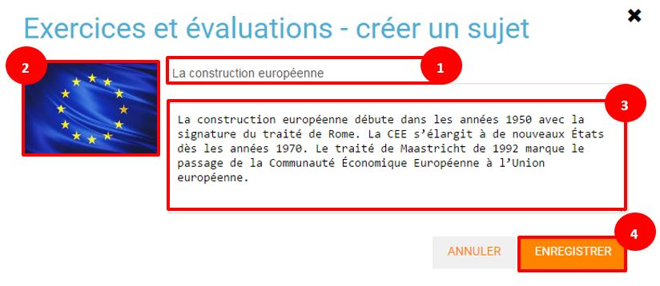

Pour ajouter du contenu à votre sujet, cliquez sur « ajouter un élément » :

  
Pour sélectionner le type de contenu à ajouter, cliquez sur « Enoncé » ou « Question ».

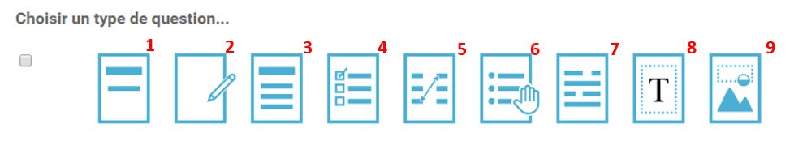

Si vous avez sélectionné l’outil question, vous pouvez choisir le type de question en cliquant sur l’une de ces  icônes.

1.  **Réponse simple**: l’apprenant doit saisir une réponse unique.

2.  **Réponse ouverte**: l’apprenant doit saisir librement la réponse (expression écrite).

3.  **Réponses multiples**: l’apprenant doit saisir les réponses possibles.

4.  **QCM**: l’apprenant doit cocher la ou les bonnes réponses parmi celles proposées.

5.  **Association**: l’apprenant doit relier différentes réponses entre elles.

6.  **Mise en ordre**: l’apprenant doit classer les réponses proposées dans le bon ordre.

7.  **Texte à trous**: l’apprenant doit compléter le texte à trous selon l’une des trois options (saisie libre, liste déroulante, glisser déposer les réponses).

8.  **Zone à remplir (textes)**: l’apprenant doit saisir la réponse ou glisser-déposer la réponse à l’endroit prévu sur l’image de fond ou sélectionner la réponse dans la liste déroulante.

9.  **Zone à remplir (images)**: l’apprenant doit glisser-déposer les images à l’endroit prévu sur l’image de fond.

Il vous suffit ensuite de compléter les champs de la question en renseignant :

1.  Le titre

2.  Le nombre de points attribués à la question

3.  L’énoncé à l’aide de l’éditeur de texte

4.  La ou les réponse(s)

5.  L’explication de la réponse

6.  L’aide à la réponse

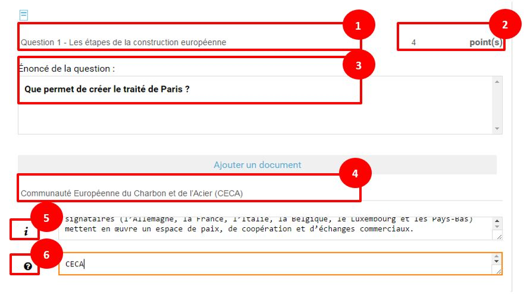

Cliquez ensuite sur « ajouter un élément » et choisissez le type de la prochaine question.

En cochant la case à gauche du titre de la question, un bandeau orange en bas de votre écran s’affiche. Vous pouvez « dupliquer » ou « supprimer » la question.

 

Le volet à gauche de l’écran vous permet de glisser et de déposer des questions avec votre  curseur pour les ordonner.

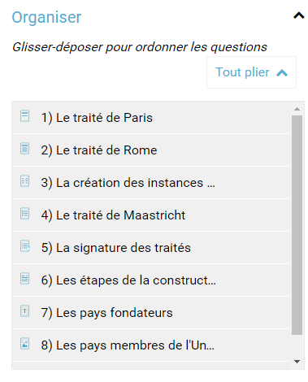

Il est possible de visualiser votre sujet en cliquant sur l’icône « aperçu » en haut à droite de votre écran.

 

Enseignant - Distribuer un sujet
================================

Une fois la création de votre sujet terminée, vous pouvez le distribuer en cliquant sur l’icône en haut à gauche de votre écran.

Saisissez les premières lettres du nom de l’utilisateur ou du groupe d’utilisateurs que vous recherchez puis sélectionnez le nom de l’utilisateur ou du groupe.

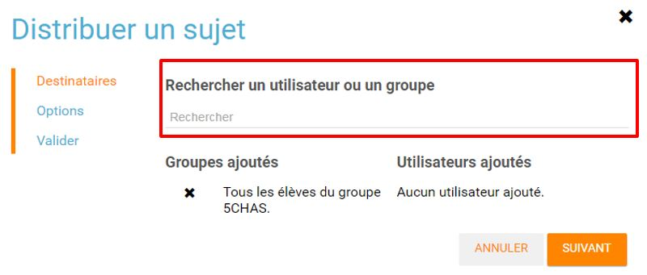

Cliquer ensuite sur le bouton « suivant ».

Les options de distribution s’affichent dans la fenêtre ci-dessous.

Renseignez les dates de début et de fin de distribution (1) ainsi que le temps de réalisation  (2).

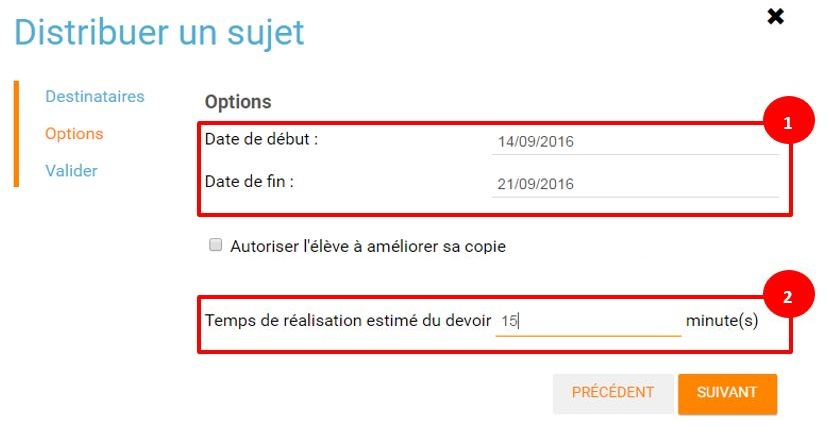

En cochant la case « Autoriser l’élève à améliorer sa copie », l’élève aura la possibilité de revenir sur sa copie après la remise dans la limite du délai imparti et de la correction par l’enseignant.

Cliquer sur « suivant » puis valider la distribution du sujet.

Enseignant - Partager un sujet
==============================

Pour partager un sujet avec d’autres utilisateurs, cliquez sur la case à cocher correspondant au sujet (1) puis sur le bouton « Partager » (2).

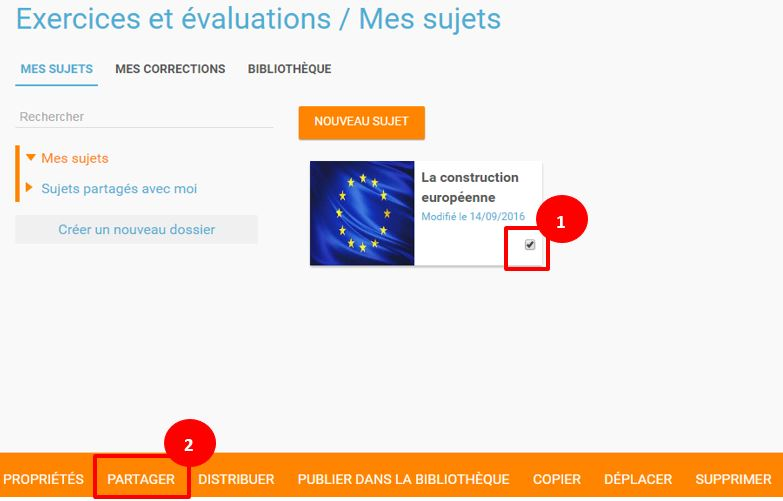

La fenêtre de partage apparaît. Pour attribuer des droits d’accès à votre sujet à d’autres utilisateurs, suivez les étapes suivantes :

1.  Saisissez les premières lettres du nom de l’utilisateur ou du groupe d’utilisateurs que vous recherchez.

2.  Sélectionnez le nom de l’utilisateur ou du groupe.

3.  Cochez les cases correspondant aux droits que vous souhaitez leur attribuer.

Vous pouvez attribuer différents droits aux autres utilisateurs de l’ENT :

-   Consulter : l’utilisateur peut consulter le sujet.

-   Contribuer : l’utilisateur peut modifier le sujet et le distribuer.

-   Gérer : l’utilisateur peut modifier, partager, distribuer ou supprimer des sujets.

La personne à qui vous avez partagé le sujet peut le retrouver dans la rubrique « Sujets partagés avec moi ». En fonction des droits accordés, elle a la possibilité de le modifier et de le distribuer en cliquant sur l’intitulé du sujet.

Elle peut aussi copier le sujet en cochant la case en bas à droite du sujet et faire des modifications dans sa propre version.

*Nota Bene : Contrairement à la publication de sujet dans la bibliothèque (cf. onglet dédié) cette fonction de partage est restreinte aux seules personnes à qui les droits de consultation, contribution et/ou gestion ont été ouverts.*

 

Enseignant - Corriger un sujet
==============================

Pour corriger un sujet, cliquez sur l’onglet « Mes corrections » en haut à gauche de l’écran.

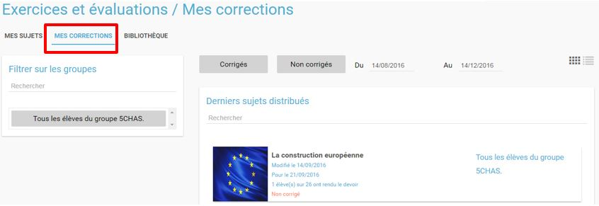

Cliquez sur le sujet que vous souhaitez corriger.

Vous arrivez sur la liste des élèves du groupe auquel vous avez distribué le sujet.

Cliquez sur le nom de l’élève pour corriger la copie (1).

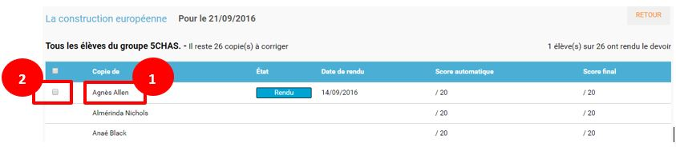

Vous pouvez cochez la case à gauche du nom de l’élève pour changer à la volée le statut de ou de plusieurs copies en "corrigé" (2).

Enseignant - Publier un sujet dans la bibliothèque
==================================================

Si vous souhaitez publier votre propre sujet dans la bibliothèque. Il vous suffit de cliquer sur l’onglet « Mes sujets » et de cocher la case en bas à droite du sujet que vous voulez publier (1). Le bandeau orange en bas de l’écran s’affiche. Cliquez sur le bouton « publiez dans la bibliothèque » (2). 

Enseignant - Chercher et copier un sujet dans la bibliothèque
=============================================================

Pour retrouver un sujet dans la bibliothèque, cliquez sur l’onglet « Bibliothèque » en haut à gauche de l’écran. Vous pouvez ensuite rechercher un sujet par étiquettes (2), titre (3) ou à l’aide du filtre par matière ou niveau (4).

Il est possible de copier le sujet dans « Mes sujets » en cochant la case à droite du sujet (1) puis en cliquant sur le bouton « copier dans mes sujets » (2).

Note de version
===============
