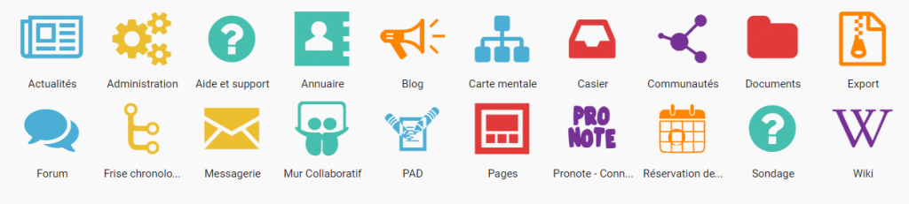
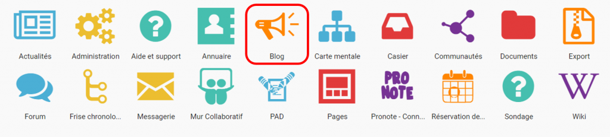

Accéder à mes applis
====================

Pour accéder à vos applis, cliquez sur l’icône correspondante dans le bandeau de navigation.

Vous accédez aux services pour lesquels vous avez des droits d’accès : applis de l’ENT, connecteurs aux outils de vie scolaire, sites web internes à l’ENT ou publics …

Pour accéder à une appli, cliquez sur l’icône correspondante.

La page d’accueil de l’appli apparaît.

Gestion des favoris
===================

La gestion des favoris vous permet d’accéder rapidement à vos applications préférées. Le menu des favoris est accessible directement depuis l’icône du bandeau de navigation (1).

[image:../../wp-content/uploads/2016/01/GESTION\_FAVORIS-300x254.png\[GESTION\_FAVORIS,width=100](../../wp-content/uploads/2016/01/GESTION_FAVORIS.png)  
\]Pour ajouter une application dans les favoris, il faut effectuer un glisser-déposer. Pour cela, sélectionnez l’application à déplacer (1) et glissez-la vers l’emplacement dédié à cet effet(2).

Note de version
===============

A chaque nouvelle version de l’application, les nouveautés seront présentées dans cette section.
