Le service **Réservation de Ressources** permet aux utilisateurs de réserver en ligne des ressources (matériel, salles, véhicules, etc.) pré-configurées par l'établissement.

Présentation
============

L’outil de réservation de ressources vous permet de faire des **demandes de réservation**, **ponctuelles ou périodiques**, de ressources (salle informatique, tablette, vidéo projecteur…). Pour chaque ressource à laquelle vous accédez, vous pouvez visualiser les créneaux horaires déjà réservés et les disponibilités via le **calendrier**.

Les ressources sont créées par des **gestionnaires** qui peuvent mettre en place un **principe de validation des réservations** pour certaines ressources et définir plusieurs paramètres (comme par exemple la date à partir de laquelle une réservation peut être effectuée).

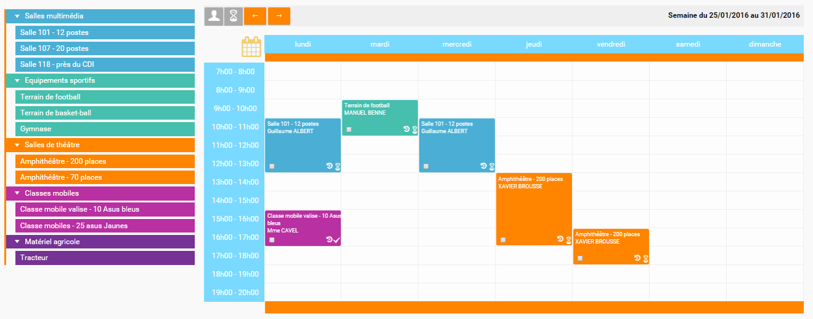

Consulter les ressources disponibles
====================================

Le** gestionnaire** de chaque **type de ressource**, choisit les utilisateurs autorisés à réserver les ressources qu’il a sous sa responsabilité.

Pour consulter les réservations enregistrées, l’utilisateur dispose de deux approches : une vue par le **calendrier**, et une vue sous la forme de **liste**.

**La vue calendrier**

La vue calendrier est accessible en cliquant sur (1)

L’utilisateur peut changer la semaine affichée en cliquant sur les flèches au dessus du calendrier (2).

L’utilisateur dispose d’un certain nombre de **filtres** :

-   Filtre sur les **types de ressources** et les **ressources** (3)

-   Filtre pour afficher uniquement **ses propres réservations**(4) :

-   Filtre pour afficher uniquement les réservations **en attente de validation**(5)

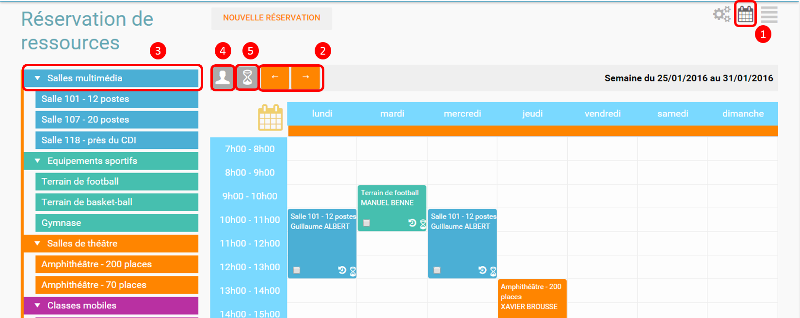

Chaque réservation est matérialisée sur le calendrier par un pavé de la même couleur que le type de ressource concerné.

-   La réservation est validée. (1)

-   La réservation est en attente de validation. (2)

-   La réservation a été refusée. (3)

-   Il s’agit d’une réservation périodique. (4)

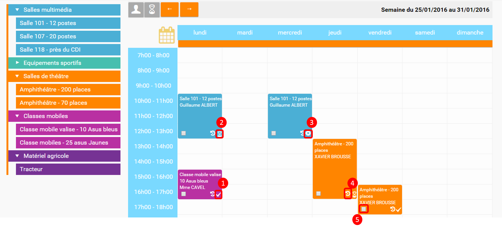  
Pour visualiser le détail d’une réservation, il suffit de cliquer sur la réservation en question, pour afficher une fenêtre (pop-up) qui présente plusieurs sections. Chaque section se déplie en cliquant sur le titre.

Pour intervenir sur une réservation (modification, validation, suppression) il suffit de cocher la case correspondant à cette réservation (5) et les boutons d’action apparaissent au bas de la page.

Si la réservation ne propose pas de case à cocher, c’est que l’utilisateur connecté n’est pas autorisé à agir sur cette réservation.

**La vue liste**  
La vue Liste est accessible en cliquant sur (1).

L’utilisateur peut afficher toute la liste des réservations effectuées entre deux dates qu’il aura choisies : (2) pour activer le filtre, (3) et (4) pour choisir les dates.

Il bénéficie par ailleurs des mêmes filtres que sur la vue Calendrier.

Le tri peut être fait sur toutes les colonnes du tableau : demandeur, ressource, date de début, date de fin et état.

**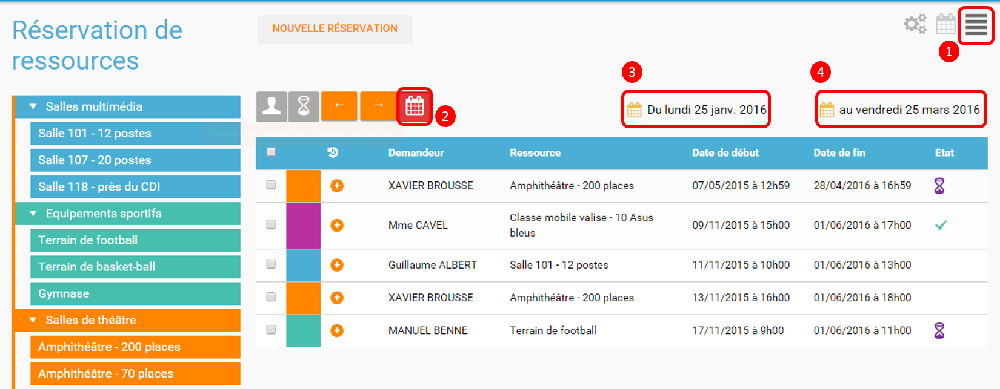**

Pour visualiser le détail d’une réservation, il suffit de cliquer sur la réservation en question dans la liste, pour afficher une fenêtre (pop-up) qui donne toutes les informations.

  

Créer une demande de réservation
================================

Il est possible de réserver une ressource :

-   Soit en cliquant sur « Nouvelle réservation » en haut de l’écran

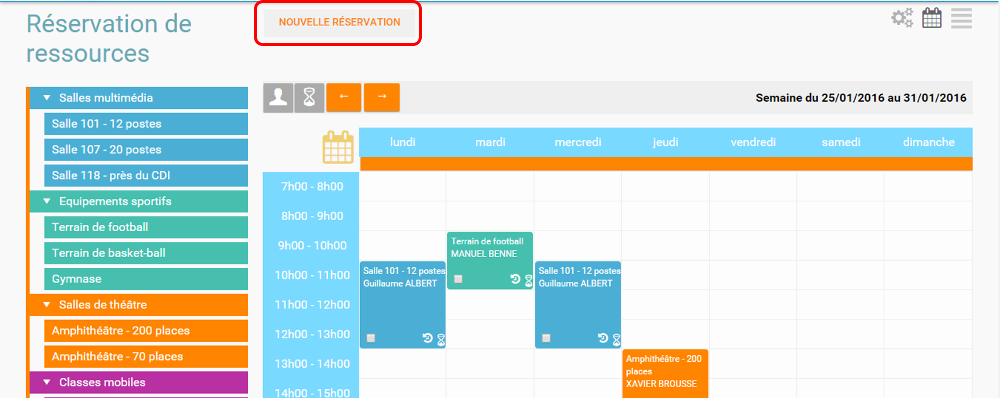

-   Soit en cliquant sur un créneau dans le calendrier.

Les deux méthodes conduisent à la même procédure de réservation.

Il est possible de créer une demande de réservation ponctuelle ou périodique. L’utilisateur choisit de créer une demande ponctuelle ou périodique en cliquant sur "Nouvelle réservation".

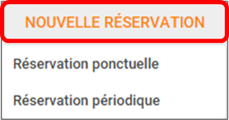

La première section permet de choisir le type de ressource (1) et la ressource à réserver (2).

La description de la ressource est indiquée (3). L’utilisateur peut également voir les noms des valideurs (4) si les réservations pour cette ressource sont soumises à validation.

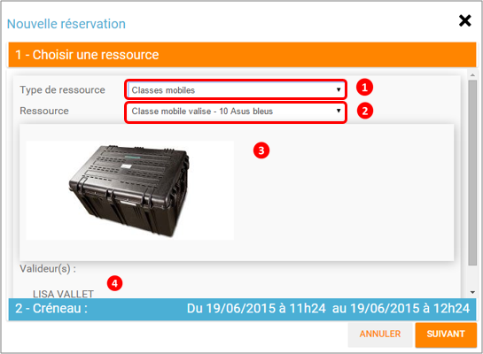  
**Réservation ponctuelle**

Dans le cas d’une réservation ponctuelle, l’utilisateur choisit le créneau de sa demande. L’utilisateur choisit le créneau de réservation (1), indique le motif de la réservation (2) et d’enregistrer sa demande. (3)

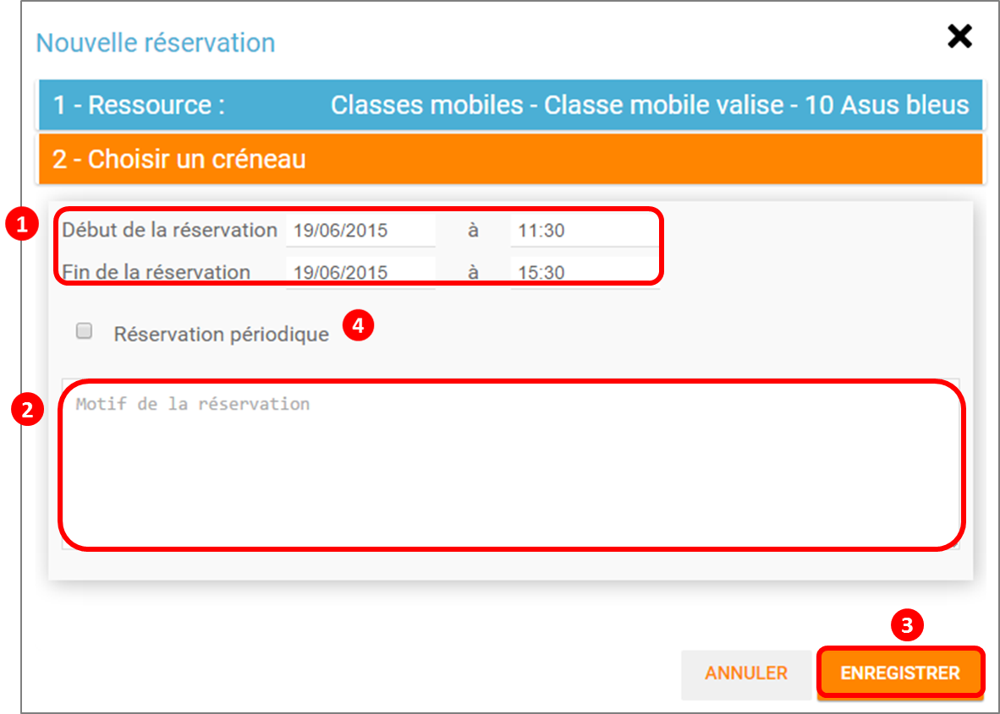

Si l’utilisateur souhaite modifier sa demande ponctuelle en demande périodique, il lui suffit de cliquer sur la case à cocher "réservation périodique" (4).

**Réservation périodique  
**Pour une réservation périodique, l’utilisateur renseigne les mêmes informations que pour une réservation ponctuelle mais configure également une périodicité.

Pour cela, il faut choisir la récurrence (1), les jours de la semaine concernés (2), le nombre d’occurrences ou une date de fin de période (3). Pour enregistrer la demande, cliquez sur "Enregistrer".

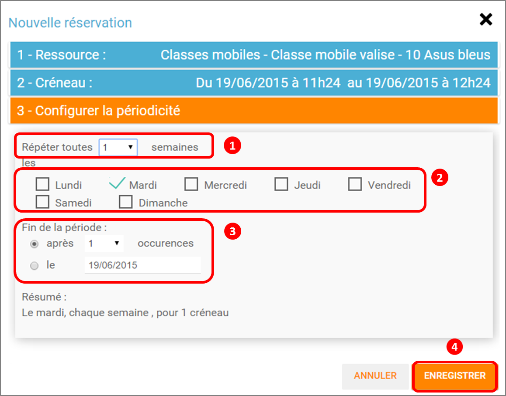  
Dans tous les cas, tous les créneaux réservés doivent satisfaire les contraintes éventuellement mises en place par le gestionnaire de la ressource concernant les intervalles minimum et maximum de réservation.

Valider une réservation
=======================

Le gestionnaire et/ou le valideur du type de ressource  peuvent valider ou refuser les demandes de réservation.

Tant qu’une demande n’a pas été validée, le créneau horaire y correspondant reste libre d’accès aux autres utilisateurs.

Pour valider une réservation, le valideur peut se rendre sur la vue Liste, effectuer un filtre sur le type de ressource (1), et afficher uniquement les réservations en attente de validation (2). L’icône signifie que la réservation est en attente de validation. (3).

  
**Valider une réservation ponctuelle**

Pour accepter ou refuser une réservation ponctuelle, le valideur doit sélectionner la réservation (1) et cliquer sur le bouton Valider ou Refuser (2).  
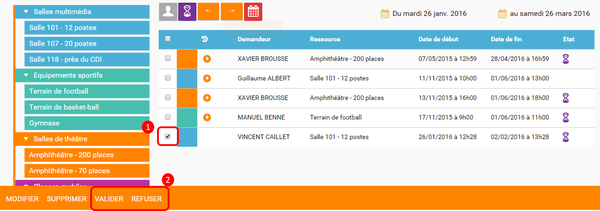

Le valideur qui refuse une réservation peut indiquer le motif de son refus (1) (champ non obligatoire), puis confirmer son refus. (2)

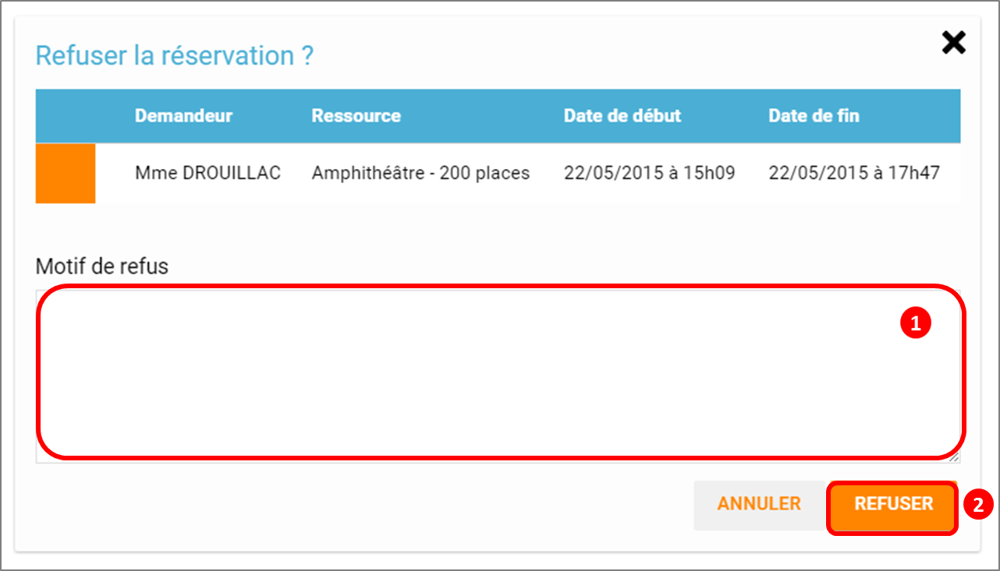  
**Valider une réservation périodique**

Pour valider une réservation périodique (qui comporte plusieurs créneaux), il est possible :

-   De valider/refuser d’un seul coup la totalité des créneaux, en cochant la case correspondant à la réservation (1) puis en cliquant sur le bouton d’action en bas de l’écran : supprimer, valider et refuser (2) :

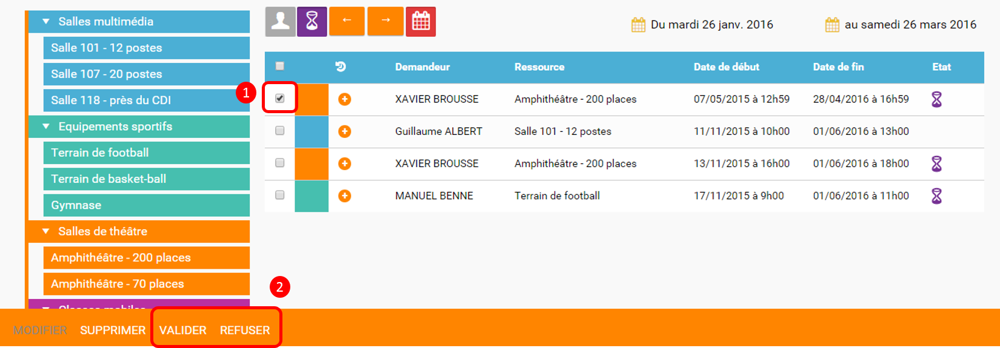

-   De déplier la réservation (1) pour visualiser les différents créneaux qui la composent en cliquant sur l’icône suivant:

Puis en sélectionnant les seuls créneaux que l’on veut valider/refuser(2) :

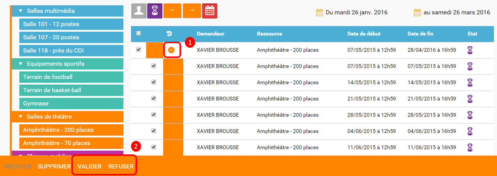

Définir les types de ressources
===============================

Pour accéder à l’interface de gestion des ressources, les utilisateurs habilités (gestionnaires) doivent cliquer sur l’icône de la molette. (1)

Pour ajouter des nouveaux types de ressources, cliquer sur « Créer un nouveau type de ressources » et renseigner les champs suivants :

-   Nom de la ressource

-   Ajout d’un circuit de validation (le cas échéant)

-   Cliquer sur Enregistrer

  
L’étape suivante consiste à  définir les droits d’accès et de gestion

-   Sélectionner le type de ressources nouvellement créé (1)

-   Cliquer sur Modifier (2)

-   Rechercher successivement les utilisateurs et/ou groupes (3) auxquels vous souhaitez donner accès à cette ressource

-   Attribuer les droits en cochant les cases correspondantes(4).

Les différents droits que vous pouvez attribuer aux autres utilisateurs sont les suivants :

-   Voir : l’utilisateur peut visualiser les réservations de la ressource

-   Réserver : l’utilisateur peut créer des demandes de réservation

-   Valider : l’utilisateur peut accepter ou refuser les demandes de réservation

-   Gérer : l’utilisateur peut créer et supprimer des types de ressources

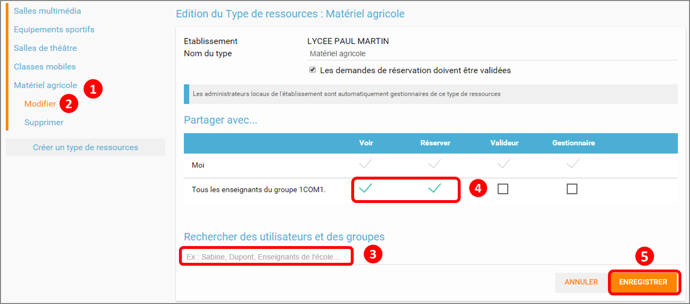

Définir les ressources
======================

Une fois les types de ressources définis, il faut créer les ressources.

Pour cela, dans l’écran suivant, cliquer sur le type de ressources (1), puis sur le bouton d’action « Créer une ressource » (2)

La ressource doit ensuite être caractérisée par:

1.  Le nom de la ressource

2.  Sa disponibilité, la possibilité de réserver cette ressource de manière périodique, un intervalle de réservation minimum et un intervalle maximum de réservation.

3.  Une description éditée par un éditeur de texte HTML permettant d’intégrer différents contenus: texte, images, liens, son…

[image:../../wp-content/uploads/2015/06/r15.png\[r1,width=502,height=411](../../wp-content/uploads/2015/06/r15.png)  
\]Après enregistrement, la nouvelle ressource s’affiche dans la liste des ressources. En cochant la case à cocher y correspondant, des boutons d’action apparaissent en bas de page pour supprimer ou éditer la ressource.

Note de version
===============

Nouveautés de la version 0.5  

**Passer facilement d’une semaine à l’autre**

Des flèches ont été ajoutées pour passer d’une semaine à l’autre dans le calendrier des ressources.

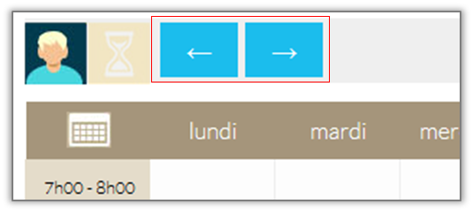  

**Le gestionnaire n’est plus soumis aux délais minimum et maximum de réservation**

Le gestionnaire d’un type de ressources n’est plus soumis aux délais minimum et maximum de réservation.

**Changement du statut des demandes sur la période d’indisponibilité d’une ressource**

Lorsqu’un gestionnaire ou un ADML rend une ressource indisponible, les réservations concernant cette ressource ayant une date de début supérieure ou égale à la date courante passent au statut "suspendu". Les personnes ayant fait des réservations sont notifiées.

La validation ou le refus d’une demande suspendue n’est pas possible mais sa suppression l’est.

Lorsqu’un gestionnaire ou un ADML rend la ressource de nouveau disponible, toutes les demandes repassent à l’état initial.

**Modification des écrans de réservation**

L’écran de création des réservations permet maintenant de créer indifféremment des réservations périodiques et ponctuelles.

Il n’est plus nécessaire de basculer entre deux écrans différents.

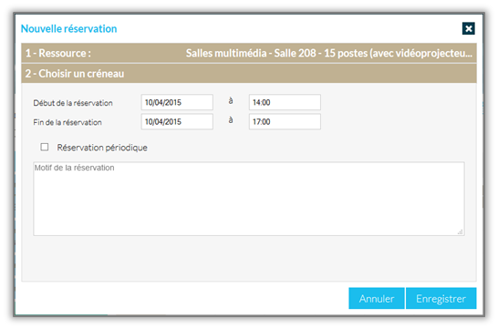

Nouveauté de la version 0.4.0

**Gestion des ressources par les administrateurs locaux**

Les administrateurs locaux sont désormais gestionnaires par défaut de tous les types de ressources rattachés aux établissements dont ils sont administrateurs.

