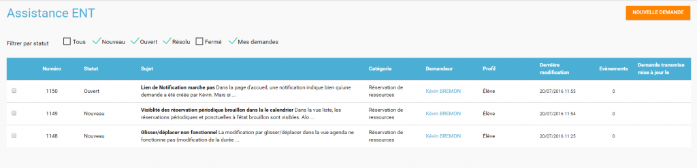
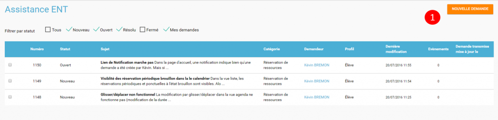
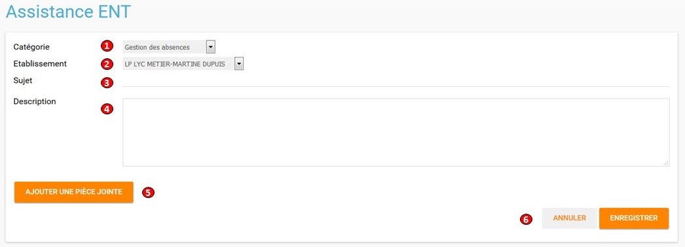
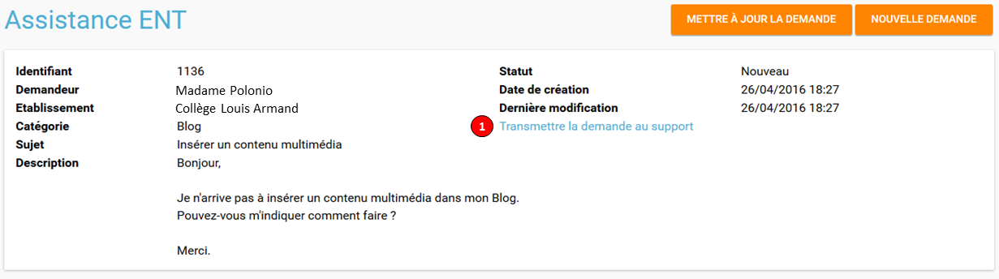
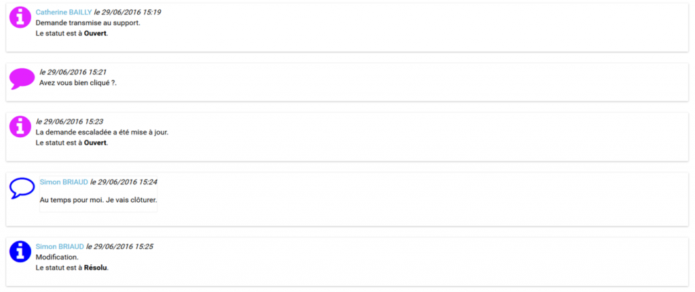
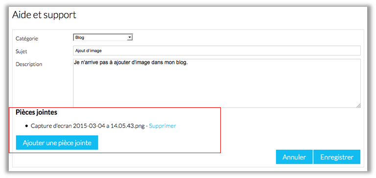

L’appli **Aide & Support** permet de signaler une difficulté ou un problème d’utilisation de l’ENT aux administrateurs de l'établissement.

Présentation
============

L’utilisateur peut faire part de ses difficultés d’utilisation ou d’un dysfonctionnement via un formulaire dans lequel il peut également ajouter une copie d’écran pour illustrer son propos. Lorsqu’une demande est créée, l’**administrateur local** reçoit une **notification** qui lui permet de consulter rapidement la demande. Il peut alors la **mettre à jour** ou **changer son statut**. L’utilisateur recevra à son tour une **notification** pour être averti des modifications et réponses.

Créer une demande
=================

La demande de création se fait en cliquant sur le bouton « Nouvelle demande » (1) disponible sur la page principale du service.

La page de création d’une nouvelle demande se présente comme suit :

La zone (1) vous permet d’indiquer quelle application de l’ENT est concernée par la demande en la choisissant dans la liste déroulante.

La zone (2) permet de choisir l'établissement concerné si vous faites parti de plusieurs établissements.

La zone (3) permet de saisir un intitulé pour la demande.

La zone (4) permet de développer votre question.

Le bouton « Ajouter une pièce jointe » (5) permet de joindre une copie d’écran ou un document pour illustrer votre propos.

La saisie est enregistrée lorsque vous cliquez sur le bouton « Enregistrer »(6).

La création d’une nouvelle demande donne lieu à l’envoi d’une notification dans le fil de nouveautés de l’administrateur de l'établissement.

Transmettre la demande au support
=================================

Certains établissements ont la possibilité d’escalader leurs demandes d’assistance auprès d’un service de support aux utilisateurs de l’ENT.  
Les référents ENT reçoivent toutes les demandes des utilisateurs et peuvent choisir d’y répondre ou de la transmettre au service de support. Pour ce faire, les référents ENT doivent cliquer sur le texte en forme de lien "Transmettre la demande au support" (1).  
  
Les référents ENT et les demandeurs de l'établissement seront notifiés sur leur fil de nouveauté lorsque le support aura fourni une réponse à la demande.

Le référent ENT et le demandeur peuvent visualiser l’ensemble des échanges.

Note de version
===============

Nouveauté de la version 0.3.0

**Ajout de pièces jointes**

Il est désormais possible d’ajouter des pièces jointes dans les demandes du service Aide et Support, par exemple pour joindre des captures d’écran. L’ajout de pièces jointes reste disponible même quand le quota d’espace disponible de l’utilisateur est atteint.

  

Nouveauté de la version 0.11

**Filtre des tickets**

On peut désormais sélectionner plusieurs statuts dans le filtre, entre Nouveau / Ouvert / Résolu / Fermé, et les combiner. Il est toujours possible de remonter tous les tickets.

Un filtre a été ajouté pour les administrateurs locaux (référents ENT) permettant de remonter les demandes dont ils sont à l’origine. Si l’on décoche cette case, la liste remontera alors les demandes d’autres personnes.

 

**Évolution de la liste des tickets**

Dans la liste des tickets, plusieurs champs ont évolué :

-   Un compteur d'événements par demande a été ajouté.

-   Une colonne Profil a été ajoutée.

-   La description et le sujet de la demande ont été fusionnés en un seul champ.

-   Une case à cocher permet de sélectionner plusieurs tickets et de les modifier en lot.

-   Le nom du demandeur permet d’accéder à son profil en un clic.

** **

**Accès direct à la création d’une nouvelle demande**

En dehors des administrateurs locaux, les utilisateurs arrivent désormais par défaut sur la page de création d’une nouvelle demande et plus sur le tableau récapitulatif de leurs demandes.

Le fonctionnement reste inchangé pour un administrateur local.

 

**Liste des événements d’une demande**

La liste des événements contient désormais des éléments liés au cycle de vie d’une demande (changement de statut, transfert de la demande, …)

Le nom du demandeur est également cliquable comme dans la liste des tickets.

 

**Notification**

Les administrateurs locaux étaient les seuls à être notifiés lorsqu’un ticket escaladé sur Redmine avait été mis à jour. Le demandeur peut à présent voir dans son fil d’actualité que des actions sont effectuées.
